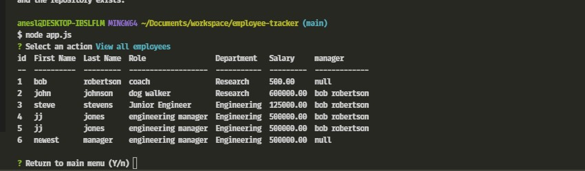

# Employee Tracker

## Description
Manage your organizational structure.  Using a command line interface,  view employees, roles or departments.  Add a new role, department or employee or change an employee role. 

## Requirements
nodejs
Mysql2
inquirer
console.table
Mysql server

## Setup
In addition to using NPM to install dependencies, this program requires a Mysql server configured in connection.js file.  

## Usage
From the initial menu select from the options:
* View all Departments
* View all roles
* View all employees
* Add a department
* Add a role
* Add an employee
* Update an employee role
* View total utilized budget

Once viewing a report, you can return to the main menu.  

if you chose to alter data, be aware to enter ids.

## Screenshot

## video link
[video link](https://drive.google.com/file/d/1CsBV9T_KB-Pv6uUVAzZJZAW432iduk8l/view)